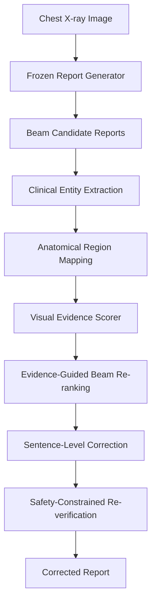

# VG-SCRRG: Verifier-Guided Self-Correcting Radiology Report Generation

Official implementation of **VG-SCRRG**, a verifier-guided, post-hoc correction framework for improving the clinical faithfulness of automated chest X-ray report generation.

VG-SCRRG verifies generated radiology reports at the entity level, estimates visual evidence support for clinical statements, applies targeted corrections to unsupported findings, and re-verifies the corrected report through a safety-constrained loop.

> **Important:** This repository provides code, configuration files, documentation, and reproducibility scripts. It does **not** redistribute MIMIC-CXR, MIMIC-CXR-JPG, patient-level metadata, radiology reports, images, or restricted clinical data.

---

## Paper

**VG-SCRRG: Verifier-Guided Self-Correcting Radiology Report Generation for Clinically Accurate CXR Interpretation**

Authors: Abdalla Tubaishat, Umair Tariq, Abdel-Rahman Tawil

Status: Under review / Accepted / Published
Paper link: To be updated
DOI: To be updated

---

## Overview

Automated radiology report generation models can produce fluent reports that contain clinically unsupported statements. These unsupported statements are problematic in medical settings because surface-level language quality does not guarantee clinical correctness.

VG-SCRRG addresses this issue using a modular, model-agnostic, post-hoc correction pipeline. Instead of retraining the original report generator, VG-SCRRG takes candidate reports generated by an existing model and improves them through evidence-guided verification and correction.

The framework consists of the following stages:

1. Candidate report generation using a frozen report generator.
2. Clinical entity extraction using RadGraph-style entity parsing.
3. Anatomical region mapping for clinical entities.
4. Entity-level visual evidence scoring.
5. Evidence-guided beam re-ranking.
6. Sentence-level correction using fusion, uncertainty hedging, and conservative deletion.
7. Safety-constrained re-verification and rollback-safe final selection.

---

## Method Summary



VG-SCRRG is designed to reduce unsupported clinical claims while preserving valid and coherent report content. It prioritizes evidence-supported reporting over reference-text overlap.

---

## Key Contributions

* **Weakly supervised visual evidence scoring** for estimating entity-level visual support in chest X-rays.
* **Region-aware cross-modal verification** using visual features, clinical entity embeddings, and anatomical region priors.
* **Dual-track correction framework** combining evidence-guided beam re-ranking and minimal sentence-level edits.
* **Safety-constrained re-verification loop** to prevent correction steps from reducing evidence alignment.
* **Model-agnostic design** that can be applied to outputs from existing report generation systems.
* **Reproducible pipeline** for data preparation, verifier training, correction, and evaluation.

---

## Main Results

VG-SCRRG improves evidence-based clinical safety metrics on both IU X-Ray and MIMIC-CXR benchmarks.

| Dataset   |        Metric | Baseline | VG-SCRRG |   Change |
| --------- | ------------: | -------: | -------: | -------: |
| IU X-Ray  | Avg. Evidence |   0.4175 |   0.4367 |  +0.0192 |
| IU X-Ray  |  Support Rate |   57.40% |   62.20% | +4.80 pp |
| IU X-Ray  |          SCAS |   0.5966 |   0.6314 |  +0.0348 |
| MIMIC-CXR | Avg. Evidence |   0.3573 |   0.3805 |  +0.0232 |
| MIMIC-CXR |  Support Rate |   10.38% |   13.24% | +2.86 pp |
| MIMIC-CXR |          SCAS |   0.1031 |   0.1311 |  +0.0280 |

Reference-based NLG metrics may decrease after correction because VG-SCRRG intentionally prioritizes evidence-supported clinical safety over strict textual overlap with reference reports.

---

## Repository Structure

```text
vg-scrrg/
│
├── configs/                 # YAML configuration files
├── src/vg_scrrg/             # Main source code
├── scripts/                 # Reproducible command-line scripts
├── notebooks/               # Original Kaggle notebooks and reproducibility notebooks
├── docs/                    # Method, dataset, model, and reproducibility documentation
├── examples/                # Synthetic public examples only
├── tests/                   # Unit tests
├── data/README.md           # Dataset access instructions
├── checkpoints/README.md    # Checkpoint release notes
├── outputs/README.md        # Output file documentation
├── requirements.txt         # Python dependencies
├── environment.yml          # Conda environment
├── CITATION.cff             # Citation metadata
├── LICENSE                  # Code license
└── README.md
```

---

## Installation

Clone the repository:

```bash
git clone https://github.com/YOUR_USERNAME/vg-scrrg.git
cd vg-scrrg
```

Create a Python environment:

```bash
python -m venv .venv
source .venv/bin/activate
```

Install dependencies:

```bash
pip install -r requirements.txt
```

Alternatively, using Conda:

```bash
conda env create -f environment.yml
conda activate vg-scrrg
```

Install the package in editable mode:

```bash
pip install -e .
```

---

## Dataset Access

This repository does not include restricted datasets.

Users must download the required datasets from their official sources and comply with each dataset’s access conditions, license, and data-use agreement.

### Primary datasets

| Dataset              | Use in this project                                         | Access                        |
| -------------------- | ----------------------------------------------------------- | ----------------------------- |
| MIMIC-CXR-JPG v2.1.0 | Main image benchmark, structured labels, recommended splits | PhysioNet credentialed access |
| MIMIC-CXR v2.0.0     | Free-text radiology reports corresponding to MIMIC-CXR-JPG  | PhysioNet credentialed access |
| IU X-Ray             | Secondary benchmark for report generation evaluation        | Public dataset source         |

### Supporting resources

| Dataset / Resource     | Use in this project                                      |
| ---------------------- | -------------------------------------------------------- |
| Chest ImaGenome        | Anatomical scene-graph and region-mapping support        |
| MS-CXR                 | Phrase-grounding support and local image-text validation |
| ReXVal                 | Expert report-error evaluation support                   |
| RadGraph / RadGraph-XL | Clinical entity and relation extraction                  |

---

## Expected Local Data Layout

After obtaining dataset access, organize files locally as follows:

```text
/path/to/datasets/
│
├── mimic-cxr-jpg/
│   ├── files/
│   ├── mimic-cxr-2.0.0-metadata.csv.gz
│   ├── mimic-cxr-2.0.0-split.csv.gz
│   └── mimic-cxr-2.0.0-chexpert.csv.gz
│
├── mimic-cxr-reports/
│   └── files/
│
├── iu-xray/
│   ├── images/
│   ├── reports/
│   └── splits/
│
├── chest-imagenome/
│
├── ms-cxr/
│
└── rexval/
```

Update dataset paths in:

```text
configs/mimic_cxr.yaml
configs/iu_xray.yaml
```

Example:

```yaml
data:
  mimic_cxr_jpg_root: /path/to/datasets/mimic-cxr-jpg
  mimic_cxr_reports_root: /path/to/datasets/mimic-cxr-reports
  split_file: mimic-cxr-2.0.0-split.csv.gz
  metadata_file: mimic-cxr-2.0.0-metadata.csv.gz
  chexpert_label_file: mimic-cxr-2.0.0-chexpert.csv.gz
```

---

## What Is Not Included

The following files are intentionally excluded:

* MIMIC-CXR images.
* MIMIC-CXR-JPG images.
* Free-text radiology reports.
* Patient-level metadata.
* Restricted dataset labels.
* Derived files that could expose restricted clinical data.
* Large model checkpoints unless separately released under permitted conditions.
* Full generated report outputs derived from restricted datasets.

Synthetic examples are provided for demonstration only.

---

## Quick Start With Synthetic Example

Run the pipeline on a synthetic example:

```bash
python scripts/run_vg_scrrg.py \
  --config configs/default.yaml \
  --input examples/synthetic_beam_candidates.json \
  --output outputs/synthetic_corrected_output.json
```

Example input:

```json
{
  "study_id": "synthetic_001",
  "image_path": "examples/synthetic_cxr.png",
  "beam_candidates": [
    {
      "beam_id": 0,
      "report": "The lungs are clear. There is mild cardiomegaly. No pleural effusion is seen.",
      "logprob": -2.14
    },
    {
      "beam_id": 1,
      "report": "The lungs are clear. No pleural effusion is seen.",
      "logprob": -2.31
    }
  ]
}
```

Example output:

```json
{
  "study_id": "synthetic_001",
  "selected_beam": 1,
  "original_report": "The lungs are clear. There is mild cardiomegaly. No pleural effusion is seen.",
  "corrected_report": "The lungs are clear. No pleural effusion is seen.",
  "removed_findings": [
    "mild cardiomegaly"
  ],
  "verification_status": "passed",
  "safety_notes": [
    "Unsupported cardiomegaly finding removed after visual evidence verification."
  ]
}
```

---

## Full Reproducibility Workflow

### 1. Prepare MIMIC-CXR data

```bash
python scripts/prepare_mimic_cxr.py \
  --config configs/mimic_cxr.yaml
```

### 2. Prepare IU X-Ray data

```bash
python scripts/prepare_iu_xray.py \
  --config configs/iu_xray.yaml
```

### 3. Train the visual evidence scorer

```bash
python scripts/train_verifier.py \
  --config configs/verifier.yaml
```

### 4. Calibrate the verifier

```bash
python scripts/calibrate_verifier.py \
  --config configs/verifier.yaml \
  --checkpoint checkpoints/verifier_best.pt
```

### 5. Generate beam candidates

```bash
python scripts/generate_candidates.py \
  --config configs/default.yaml \
  --dataset mimic_cxr \
  --num_beams 3 \
  --num_return_sequences 3 \
  --output outputs/mimic_beam_candidates.json
```

### 6. Run VG-SCRRG correction

```bash
python scripts/run_vg_scrrg.py \
  --config configs/correction.yaml \
  --input outputs/mimic_beam_candidates.json \
  --output outputs/mimic_corrected_reports.json
```

### 7. Evaluate reports

```bash
python scripts/evaluate_reports.py \
  --config configs/evaluation.yaml \
  --predictions outputs/mimic_corrected_reports.json
```

### 8. Reproduce main results

```bash
bash scripts/reproduce_main_results.sh
```

---

## Configuration

Main correction parameters are defined in:

```text
configs/correction.yaml
```

Example:

```yaml
correction:
  num_beams: 3
  lambda_evidence: 0.70
  deletion_threshold: 0.30
  hedge_threshold: 0.42
  fusion_similarity_threshold: 0.72
  max_fusions_per_report: 2
  max_reverification_iterations: 2
  minimum_sentences_to_keep: 3
```

Verifier configuration:

```yaml
verifier:
  visual_encoder: densenet121
  text_encoder: bioclinicalbert
  hidden_dim: 512
  dropout: 0.30
  attention_dropout: 0.15
  label_smoothing: 0.05
  mixup_alpha: 0.30
  ema_decay: 0.999
  calibration: platt_scaling
```

---

## Original Kaggle Notebooks

The original Kaggle development notebooks are provided for transparency:

```text
notebooks/kaggle_original/
├── 01_data_preprocessing.ipynb
├── 02_visual_evidence_scorer.ipynb
├── 03_dual_track_correction.ipynb
└── 04_evaluation_analysis.ipynb
```

These notebooks are preserved as development artifacts. For clean and reusable research code, use the scripts and package modules under:

```text
src/vg_scrrg/
scripts/
configs/
```

---

## Pipeline Components

### 1. Candidate Report Generation

VG-SCRRG expects beam-search candidate reports from a frozen report generator. In the paper, R2Gen is used as the upstream generator with beam size 3.

### 2. Clinical Entity Extraction

Generated reports are converted into structured clinical entities. Entity categories include:

* Observation definitely present.
* Observation definitely absent.
* Observation uncertain.
* Anatomy definitely present.

### 3. Anatomical Region Mapping

Extracted clinical entities are mapped to coarse anatomical regions, including:

| Region ID | Region                       |
| --------: | ---------------------------- |
|         0 | Left lung field              |
|         1 | Right lung field             |
|         2 | Pleura / costophrenic angles |
|         3 | Diaphragm / upper abdomen    |
|         4 | Bones / ribs / spine         |
|         5 | Devices / lines / tubes      |
|         6 | Global / other               |

### 4. Visual Evidence Scoring

The verifier estimates whether a clinical entity is supported by the input chest X-ray. The scorer uses:

* Frozen DenseNet-121 visual encoder.
* Frozen Bio_ClinicalBERT text encoder.
* Region-aware cross-attention.
* Entity-level evidence prediction head.
* Post-hoc calibration.

### 5. Evidence-Guided Beam Re-ranking

Candidate reports are re-ranked using a composite score that balances generator confidence and visual evidence support.

### 6. Sentence-Level Correction

Unsupported or weakly supported sentences are corrected through:

* Evidence-guided sentence fusion.
* Uncertainty hedging.
* Conservative sentence deletion.

### 7. Safety-Constrained Re-verification

The corrected report is re-scored. If the correction reduces evidence alignment, VG-SCRRG rolls back to the safer previous report.

---

## Evaluation Metrics

VG-SCRRG supports three metric groups.

### Reference-based NLG metrics

* BLEU-1 to BLEU-4.
* ROUGE-L.
* METEOR.
* CIDEr-D.

### Structure-based clinical metrics

* RadGraph entity score.
* RadGraph entity-relation score.
* F1-RadGraph-style overlap.

### Evidence-based metrics

* Average entity-level evidence score.
* Support rate.
* SCAS.
* SCAS-F1.
* Pathology-stratified evidence analysis.
* Directional improvement/degradation analysis.
* Bootstrap confidence intervals.
* Wilcoxon signed-rank test.
* McNemar test.

---

## Model Checkpoints

Model checkpoints are not included in this repository by default.

If checkpoints are released, they will be provided through an approved external release location and documented in:

```text
checkpoints/README.md
```

Checkpoint release is subject to:

* Dataset license conditions.
* Data-use agreements.
* Institutional approval.
* Ethical requirements.
* Removal of restricted or patient-derived content.

---

## Reproducibility Notes

To improve reproducibility:

* Use the provided config files.
* Do not hardcode dataset paths.
* Set random seeds.
* Log package versions.
* Store run metadata.
* Keep original Kaggle notebooks but run experiments through scripts.
* Report whether checkpoints are trained from scratch or downloaded.
* Report whether evaluation uses synthetic, IU X-Ray, MIMIC-CXR, or another dataset.

Example seed configuration:

```yaml
seed: 42
deterministic: true
```

---

## Known Limitations

VG-SCRRG is a research framework and has several limitations:

1. The visual evidence scorer is trained under weak supervision.
2. The correction quality depends on verifier accuracy.
3. Evidence-based evaluation may be partially self-referential if the same verifier guides and evaluates correction.
4. Region mapping uses deterministic and heuristic components.
5. The reported experiments use R2Gen as the upstream generator.
6. Complex multi-finding reports may be vulnerable to overcorrection.
7. Independent radiologist validation is required before any clinical use.

---

## Future Work

Potential extensions include:

* Integration with stronger multimodal report generators.
* Evaluation with large multimodal language models.
* Adaptive evidence thresholds for complex reports.
* Radiologist-in-the-loop validation.
* External validation on multi-institutional datasets.
* Extension to CT, MRI, and other imaging modalities.
* Generation-time verification instead of post-hoc-only correction.
* Improved uncertainty calibration.
* More robust phrase-grounding evaluation.

---

## Clinical and Ethical Disclaimer

VG-SCRRG is intended for research use only.

It is not a medical device and is not intended for clinical diagnosis, treatment decisions, or direct deployment in patient care. Any clinical use would require independent validation, regulatory review, institutional approval, and expert radiologist oversight.

---

## Contributing

Contributions are welcome.

Good contribution areas include:

* Additional report generators.
* Better visual evidence scorers.
* More robust entity extraction.
* Improved anatomical region mapping.
* Independent evaluation metrics.
* Additional benchmark support.
* Documentation improvements.
* Tests and reproducibility tools.

Please read `CONTRIBUTING.md` before submitting a pull request.

---

## Citation

If you use this repository, please cite the associated paper:

```bibtex
@article{tubaishat2026vgscrrg,
  title   = {VG-SCRRG: Verifier-Guided Self-Correcting Radiology Report Generation for Clinically Accurate CXR Interpretation},
  author  = {Tubaishat, Abdalla and Tariq, Umair and Tawil, Abdel-Rahman},
  journal = {To be updated},
  year    = {2026}
}
```

Please also cite the official datasets used in your experiments, including MIMIC-CXR, MIMIC-CXR-JPG, IU X-Ray, Chest ImaGenome, MS-CXR, and ReXVal where applicable.

---

## License

The source code is released under the license specified in the `LICENSE` file.

The datasets used by this project are not distributed in this repository and remain subject to their own licenses, access requirements, and data-use agreements.

---

## Contact

For questions, reproducibility issues, or collaboration requests, please open a GitHub issue or contact the corresponding author.
