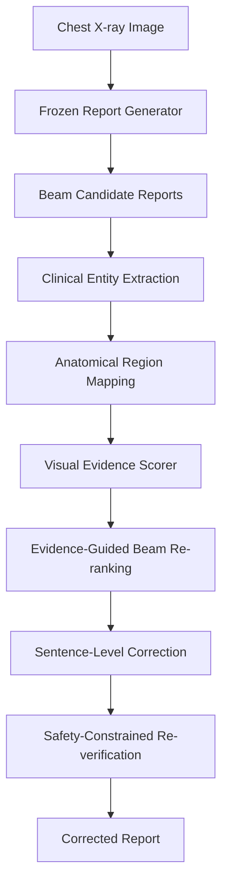

# VG-SCRRG: Verifier-Guided Self-Correcting Radiology Report Generation

Official notebook-based implementation of **VG-SCRRG**, a verifier-guided, post-hoc correction framework for improving the clinical faithfulness of automated chest X-ray radiology report generation.

VG-SCRRG verifies generated reports at the clinical entity level, estimates visual evidence support from chest X-ray images, applies targeted corrections to unsupported statements, and re-verifies the corrected report through a safety-constrained loop.

> **Important:** This repository does not redistribute MIMIC-CXR, MIMIC-CXR-JPG, radiology reports, images, patient-level metadata, checkpoints, or restricted dataset-derived files. Users must obtain all required datasets from their official sources and comply with the relevant licenses and data-use agreements.

---

## Paper

**VG-SCRRG: Verifier-Guided Self-Correcting Radiology Report Generation for Clinically Accurate CXR Interpretation**

Authors: Abdalla Tubaishat, Umair Tariq, Abdel-Rahman Tawil

Status: To be updated

Paper link: To be updated

DOI: To be updated

---

## Overview

Automated radiology report generation models can produce fluent reports that include clinically unsupported statements. These unsupported claims may reduce trust and create safety risks in clinical settings.

VG-SCRRG addresses this issue through a model-agnostic, post-hoc verification and correction framework. Instead of retraining the original report generator, VG-SCRRG operates on generated candidate reports and improves them using entity-level visual evidence scoring and conservative correction rules.

The framework includes:

1. Candidate report generation using a frozen report generator.
2. Clinical entity extraction from generated reports.
3. Anatomical region mapping for extracted clinical entities.
4. Visual evidence scoring for entity-level verification.
5. Evidence-guided candidate re-ranking.
6. Sentence-level correction using fusion, hedging, and conservative deletion.
7. Safety-constrained re-verification and rollback-safe output selection.

---

## Repository Contents

This repository currently provides the original notebook-based implementation used to support the VG-SCRRG experiments. It does not currently include a reusable `src/` package, command-line scripts, tests, or released model checkpoints.

```text
VG-SCRRG-Verifier-Guided-Self-Correcting-Radiology-Report-Generation/
|
|-- README.md
|-- LICENSE
|-- CITATION.cff
|-- requirements.txt
|
|-- notebooks/
|   |-- 01_candidate_generation_r2gen_baseline.ipynb
|   |-- 02_visual_evidence_scorer_training_and_validation.ipynb
|   |-- 03_entity_extraction_region_mapping_and_analysis.ipynb
|   `-- 04_correction_evaluation_results_and_ablation.ipynb
|
|-- data/
|   `-- README.md
|
|-- outputs/
|   `-- README.md
|
`-- checkpoints/
    `-- README.md
```

---

## Notebook Modules

| Notebook | Description |
| --- | --- |
| `01_candidate_generation_r2gen_baseline.ipynb` | R2Gen setup, MIMIC-CXR test subset loading, baseline report generation, pathology mention analysis, and baseline output export. |
| `02_visual_evidence_scorer_training_and_validation.ipynb` | MIMIC-CXR data preparation, weakly supervised entity-image sample creation, DenseNet-121 and Bio_ClinicalBERT feature extraction, visual evidence scorer training, calibration, ablation, and MS-CXR / Chest ImaGenome validation hooks. |
| `03_entity_extraction_region_mapping_and_analysis.ipynb` | RadGraph-XL entity extraction, anatomical region mapping, Chest ImaGenome-assisted analysis, audit exports, failure analysis, and F1-RadGraph evaluation. |
| `04_correction_evaluation_results_and_ablation.ipynb` | VG-SCRRG correction pipeline, evidence-guided re-ranking, sentence-level fusion/hedging/deletion, re-verification, NLG and clinical metric evaluation, figures, and ablation analysis. |

---

## Method Summary



---

## Key Features

* Model-agnostic post-hoc correction.
* Entity-level clinical verification.
* Region-aware visual evidence scoring.
* Evidence-guided beam re-ranking.
* Sentence-level correction using conservative edits.
* Uncertainty hedging for weakly supported findings.
* Re-verification loop with rollback-safe final selection.
* Notebook-based reproducibility workflow.

---

## Installation

Clone the repository:

```bash
git clone https://github.com/MANEEQ786/VG-SCRRG-Verifier-Guided-Self-Correcting-Radiology-Report-Generation.git
cd VG-SCRRG-Verifier-Guided-Self-Correcting-Radiology-Report-Generation
```

Create a Python environment:

```bash
python -m venv .venv
source .venv/bin/activate
```

Install dependencies:

```bash
pip install -r requirements.txt
```

Launch Jupyter:

```bash
jupyter notebook
```

Then run the notebooks in order from the `notebooks/` folder.

---

## Recommended Notebook Execution Order

```text
1. notebooks/01_candidate_generation_r2gen_baseline.ipynb
2. notebooks/02_visual_evidence_scorer_training_and_validation.ipynb
3. notebooks/03_entity_extraction_region_mapping_and_analysis.ipynb
4. notebooks/04_correction_evaluation_results_and_ablation.ipynb
```

The notebooks were developed in a Kaggle-style environment and contain dataset paths such as `/kaggle/input/datasets/...`. Update paths locally or mount equivalent datasets before running.

---

## Dataset Access

This repository does not include clinical datasets.

The experiments use datasets and resources such as:

* MIMIC-CXR.
* MIMIC-CXR-JPG.
* IU X-Ray.
* Chest ImaGenome.
* MS-CXR.
* ReXVal.
* RadGraph / RadGraph-XL resources.

Users must download datasets from their official sources and comply with all access rules, credentialing requirements, licenses, and data-use agreements.

Do not commit or upload:

* Chest X-ray images.
* Radiology reports.
* Patient-level metadata.
* Restricted labels.
* Dataset-derived files that expose restricted clinical content.
* Full generated outputs from restricted datasets.
* Model checkpoints unless release is explicitly permitted.

---

## Expected Local Data Setup

After obtaining dataset access, configure local paths inside the notebooks according to your machine.

Recommended local structure:

```text
/path/to/datasets/
|
|-- mimic-cxr-jpg/
|-- mimic-cxr-reports/
|-- iu-xray/
|-- chest-imagenome/
|-- ms-cxr/
`-- rexval/
```

The repository intentionally does not include these files.

---

## Main Results

VG-SCRRG improves evidence-based clinical safety metrics on IU X-Ray and MIMIC-CXR.

| Dataset | Metric | Baseline | VG-SCRRG | Change |
| --- | ---: | ---: | ---: | ---: |
| IU X-Ray | Avg. Evidence | 0.4175 | 0.4367 | +0.0192 |
| IU X-Ray | Support Rate | 57.40% | 62.20% | +4.80 pp |
| IU X-Ray | SCAS | 0.5966 | 0.6314 | +0.0348 |
| MIMIC-CXR | Avg. Evidence | 0.3573 | 0.3805 | +0.0232 |
| MIMIC-CXR | Support Rate | 10.38% | 13.24% | +2.86 pp |
| MIMIC-CXR | SCAS | 0.1031 | 0.1311 | +0.0280 |

Reference-based NLG metrics may decrease after correction because VG-SCRRG prioritizes evidence-supported clinical safety over strict textual overlap with reference reports.

---

## Reproducibility Notes

This repository currently provides notebook-based reproducibility. For best results:

1. Run notebooks in order.
2. Update dataset paths locally.
3. Keep random seeds fixed.
4. Do not modify test splits.
5. Do not commit dataset files, generated outputs, or checkpoints.
6. Record package versions and GPU details.
7. Save outputs locally under the `outputs/` folder.

---

## Limitations

VG-SCRRG is a research framework and has several limitations:

* The visual evidence scorer is trained under weak supervision.
* Correction quality depends on verifier accuracy.
* Evidence-based evaluation may be partially self-referential if the same verifier guides and evaluates correction.
* Region mapping contains deterministic and heuristic components.
* The current implementation is notebook-based.
* The current notebooks use Kaggle-style paths and may require path edits for local execution.
* Independent clinical validation is required before any practical clinical use.

---

## Future Work

Planned improvements include:

* Refactoring notebooks into a reusable Python package.
* Adding command-line scripts for full reproducibility.
* Adding configuration files for experiments.
* Supporting additional report generators.
* Improving anatomical region mapping.
* Adding more robust independent evaluation.
* Extending the framework to larger multimodal models.
* Supporting additional imaging modalities.

---

## Clinical Disclaimer

VG-SCRRG is intended for research use only.

It is not a medical device and must not be used for clinical diagnosis, treatment planning, or direct patient care. Any clinical use would require independent validation, regulatory approval, institutional review, and expert radiologist oversight.

---

## Citation

If you use this repository, please cite the associated paper:

```bibtex
@article{tubaishat2026vgscrrg,
  title   = {VG-SCRRG: Verifier-Guided Self-Correcting Radiology Report Generation for Clinically Accurate CXR Interpretation},
  author  = {Tubaishat, Abdalla and Tariq, Umair and Tawil, Abdel-Rahman},
  journal = {To be updated},
  year    = {2026}
}
```

Please also cite the datasets and external resources used in your experiments according to their official citation guidelines.

---

## License

The source code is released under the license specified in the `LICENSE` file.

Datasets are not distributed with this repository and remain subject to their own licenses and access conditions.

---

## Contact

For questions, issues, or collaboration requests, please open a GitHub issue or contact the corresponding author.
